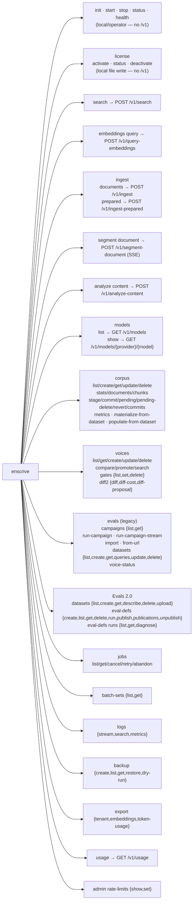

# State of Enscrive — `enscrive-cli`

> **Independent line-by-line audit of the `main` (default-branch) state.**
> Scope: this repository only. This is a documentation deliverable — no
> source or configuration was changed. Every claim below is anchored to a
> `file:line` reference so it can be checked against the code.
>
> Companion docs (this file is the anchor):
> - [`cli-parity-table.md`](./cli-parity-table.md) — the full command ↔ `/v1` endpoint parity table.
> - [`cli-flows.md`](./cli-flows.md) — annotated walkthroughs (init · ingest · search · eval) + the async-job model.
> - [`cli-findings.md`](./cli-findings.md) — the findings register (drift, dead code, no-implicit-defaults audit, security posture), with severity and evidence.

---

## 1. Executive assessment

`enscrive-cli` is the **thin, deterministic public wrapper over the `/v1`
API** that the platform story asks it to be. It ships a single statically
linked binary (`enscrive`, crate `enscrive` v0.1.0, Rust edition 2024,
~15.6k LOC across `src/`), authenticates with **nothing but an Enscrive API
key** (plus an optional BYOK embedding-provider key), and carries **no
platform credentials, no ESM, no Keycloak, no database** in its request
path. On those terms it is faithful to the mission.

The platform's two engines and its unifying abstraction are all present as
first-class command surfaces:

| Platform concept | CLI surface |
|---|---|
| Pure **embedding engine** | `enscrive embeddings query` → `POST /v1/query-embeddings` |
| Pure **neural-search engine** | `enscrive search` → `POST /v1/search` |
| **Agent Voices** (multi-layer embedding) | `enscrive voices …` (`/v1/voices/*`) |
| **Eval vision** (BeIR end-to-end) | `enscrive evals …` (legacy) + Evals 2.0 (`datasets` / `eval-defs` / `eval-runs`) + `corpus populate-from-dataset` / `materialize-from-dataset` |
| **Async-by-default mutations, sync neural search** | search/embeddings return synchronously; ingest / populate / eval-runs launch a job and poll `GET /v1/jobs/{id}` (`--async` to short-circuit) |

**The founder's open question — _does the CLI faithfully and completely
mirror the `/v1` surface, or has it drifted?_ — has a precise answer:**

> **At the level of request logic, parity is real and the determinism
> thesis holds.** The CLI invents no model defaults, forces explicit model
> declaration where it matters, and maps cleanly onto `/v1` paths.
> **But the artifact that is supposed to _prove_ that parity —
> `v1-surface-contract.toml` and its tests — has itself drifted and
> under-verifies.** The contract is a self-consistent _registry_, not a
> verified _mirror_: it does not check request/response shapes, does not
> check that its `cli_command` names match the real command paths, and
> only checks the contract→CLI direction for status hygiene (no `missing`
> rows), not against the live command tree.

So a "poorly-formed CLI as a downstream symptom of upstream drift" is **not**
what the evidence shows. The command logic is in better shape than the
contract bookkeeping that tracks it. The drift is in the **parity artifact
and the docs**, not in the wire behaviour. Three concrete drifts prove the
point (full detail in [`cli-findings.md`](./cli-findings.md)):

1. **A deferred endpoint is actually shipped.** `voices update` is
   `status = "deferred"` in the contract (`v1-surface-contract.toml:354`,
   reason "requires config schema alignment"), yet it is fully implemented:
   `main.rs:3920-3989` runs a `POST /v1/voices/{id}/diff-proposal` impact
   preview, gates corpus-invalidating changes behind `--confirm-re-embed`,
   then `PUT /v1/voices/{id}`. The tests cannot catch this because
   `deferred` is a valid status and the build-time tier table includes
   deferred rows.

2. **Contract command names no longer match the real command paths.**
   The contract calls them `voices diff` / `eval-runs list`; you actually
   invoke `enscrive voices diff2 diff` and `enscrive eval-defs runs list`
   (`main.rs:894`, `evals2.rs:164,236`). For `eval-runs` the divergence is
   three-way: you type `eval-defs runs list`, the contract says
   `eval-runs list`, and the JSON envelope's `command` field also says
   `eval-runs list` (`evals2.rs:775`).

3. **The escape-hatch skip list is largely stale.** Of the 46 entries in
   `TIER_SKIP_LIST` (`main.rs:6958-7017`), roughly 32 are dead: ~25 name
   commands that **now have contract rows** (e.g. `corpus get`,
   `models show`, `datasets list`, the whole `eval-defs` block) — so the
   leaf-coverage test catches them via the contract table _first_ and the
   skip entry is never reached — and 7 name a `deploy *` subtree that **no
   longer exists in the command tree at all** (there is no `Deploy` command
   and no `src/deploy.rs`). Their "contract row pending" comments are false.

None of this breaks a single command — but anyone who trusts the contract
as the source of truth for "what the CLI does" would be misled today.

---

## 2. Scored rubric

Grades reflect the `main` state as audited. Evidence lives in the linked
docs; representative `file:line` anchors are inline.

### 2.1 Mission alignment — **Strong (A‑)**
The thin-wrapper, API-key-only, no-ESM contract is honoured exactly. Only
`X-API-Key` and an optional `X-Embedding-Provider-Key` header are ever sent
(`client.rs:207-213`); there is no platform-credential code path, and
`CODEOWNERS` itself records that the repo has "no auth-middleware /
migrations / billing / ESM." Both engines, Agent Voices, and the full
eval vision are surfaced. The one soft spot: no CLI-version / User-Agent
header is attached to requests (`client.rs`), which weakens the "CLI as the
platform's primary test harness" story — the server can't attribute or
version-gate CLI traffic.

### 2.2 Contract truth (CLI ↔ `/v1` parity) — **Moderate (C+)**
A contract exists, parses, is CI-gated, and has **zero `missing` rows**
across **101 endpoints (89 implemented, 12 deferred)** — genuinely good
hygiene. But it is a registry, not a mirror (see §1). The parity test in
`tests/surface_contract.rs` only checks the TOML's internal consistency; the
real CLI↔table check lives in `main.rs:7042` and enforces only that every
clap leaf is _either_ contracted _or_ skip-listed. Shape fidelity is
unchecked; name accuracy is unchecked; the deferred-but-shipped
`voices update` row is a falsehood the suite is structurally blind to.

### 2.3 Correctness & determinism (no client-invented defaults) — **Good (B+)**
On the axis that the platform actually cares about — **model resolution** —
the CLI is clean. `corpus create` _requires_ `--embedding-model` (a
non-`Option` field, `main.rs:830`); `search` and `embeddings query` inject
**no** model or voice default and defer resolution to the corpus/voice
server-side (`build_search_body`, `main.rs:2553`). The violations that do
exist are about **connection target and UX**, not model identity: a
hard-coded `http://localhost:3000` base-URL fallback
(`local.rs:499`, duplicated `main.rs:3437`); a client-injected
`source_type = "huggingface"` on dataset create (`evals2.rs:62`); and a
**non-deterministic** random-UUID `corpus_id` + timestamp dataset-name in
`evals from-url` (`main.rs:2376-2389`).

### 2.4 Drift & dead code — **Moderate (C+)**
Nothing is functionally broken, but cruft is accumulating: the stale
skip-list block (§1.3), a stale unit test asserting `corpus get` is "not yet
available" (`main.rs:6027-6036`) that the shipped handler contradicts
(`main.rs:3766`), a misnamed `release_channel.rs` (it is platform-target
logic, no channel concept), an unconstructed `FetchError::BinaryNotInManifest`
variant, a founder-gate grep for `src/{signature,provision,manifest,fingerprint}.rs`
files that don't exist (`.github/scripts/pr-review.sh`), the install URL
documented three different ways, and a release pipeline that ships **one**
platform while the README advertises five.

### 2.5 V1 launch readiness — **Moderate (B‑)**
The functional surface is broad, the JSON envelope is stable and well
exit-coded, and the beta status is labelled honestly in the README. The
blockers to a confident GA are mostly **supply-chain and trust**, not
features: the in-CLI binary fetch (`enscrive init`) verifies SHA256 only —
**no signature** yet (`fetch_verify.rs` TODO ENS-82), while the standalone
`install.sh` _does_ do optional cosign; release builds cover a single
target; client-side plan gating is dead (`main.rs:3225`); and the license
JWT is decoded without signature/expiry verification (`license.rs:57-81`).
All defensible for a pre-launch beta, all worth closing before GA.

---

## 3. Command tree

`enscrive` exposes 24 top-level commands. Leaves map to `/v1` endpoints
except the local/operator set (`init`, `start`, `stop`, `status`, `health`,
`license *`). The full per-leaf endpoint mapping is in
[`cli-parity-table.md`](./cli-parity-table.md).

> **Naming-drift note (rendered as the code actually behaves):** the
> Evals 2.0 run operations are nested under `eval-defs runs …` and the voice
> diff analyzer under `voices diff2 …`, **not** under the `eval-runs` /
> `voices diff` names the contract uses. See
> [`cli-findings.md`](./cli-findings.md) F2.

---

## 4. How parity is (and isn't) enforced

There are **two** independent mechanisms, and neither one closes the loop
the way the contract header implies.

**Layer A — `tests/surface_contract.rs` (contract self-consistency).**
`include_str!`s the TOML and asserts properties of the TOML *in isolation*:
no `missing` rows (`:44`), deferred rows carry a reason (`:70`), valid
status/tier/plan enums, no duplicate `method+path`, and `managed-only ⇒
non-free`. It **never loads the clap tree**, so it cannot detect that a
`cli_command` string names a command that doesn't exist or is named
differently.

**Layer B — `command_tiers_covers_every_leaf_subcommand` (`main.rs:7042`).**
Walks `Cli::command()` for every leaf and asserts each is in `COMMAND_TIERS`
(the `build.rs`-generated table sourced from the contract) **or** in
`TIER_SKIP_LIST`. This enforces the **CLI→contract** direction (no orphan
commands) but tolerates a large skip list, and says nothing about request
or response shapes.

**Net:** `missing`-status drift is caught; *semantic* drift (deferred-but-
shipped, renamed commands, stale skip entries, wrong shapes) is not. The
build-time codegen that wires the contract into the binary is in `build.rs`
(`COMMAND_TIERS`, consumed at `main.rs:32`); the same table drives runtime
tier gating in `preflight.rs`.

---

## 5. What I could and could not verify honestly

This audit is a **static read of the source**; no live `/v1` service was
available to the routine.

- **Verifiable from the code, and verified:** the command tree, every
  command's HTTP verb and `/v1` path, request-body construction, the
  envelope/exit-code contract, the no-implicit-defaults posture for model
  resolution, the parity-test mechanism, and every drift/dead-code finding —
  all carry `file:line` evidence.
- **Not verifiable from here (documented, not asserted):** whether the
  **server** honours the request shapes the CLI sends, whether server-side
  response shapes match what handlers read, and the actual end-to-end
  behaviour of async jobs and SSE streams. These require a running `/v1`
  and are called out as such in [`cli-flows.md`](./cli-flows.md). Confirming
  them is a documented manual / integration-harness step, not something this
  static audit can prove.
